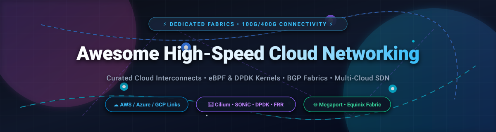

# Awesome-High-Speed-Cloud-Networking

# Awesome-High-Speed-Cloud-Networking ⚡ 🌐

  

  

  

  

  

  

  

---

## 🌟 Top High-Speed Cloud Networking Ecosystem

**Curated List of Commercial High-Speed Networking Platforms & Open-Source Network Fabric Tools**  

*Focused on Dedicated Interconnects, 100G/400G Connectivity, Private Backbone, Multi-Cloud Fabric, BGP Route Exchange & Self-Hosted Network Orchestration*

**Last updated: October 2026** 📅

---

### 📌 Overview & SEO Summary

Welcome to the ultimate curated directory of **high-speed cloud networking platforms**, **open-source network fabric tools**, and **multi-cloud interconnect frameworks**. Whether you are looking for enterprise-grade commercial solutions (such as *AWS Fiber*, *Azure ExpressRoute Direct*, and *Google Cloud Dedicated Interconnect*), or self-hostable open-source alternatives (like *SONiC*, *FRRouting*, and *VyOS*), this list covers category leaders, 100G/400G connectivity, and privacy-respecting high-speed networking.

**Key Market Context:**

- **AWS Fiber** provides **dedicated 100 Gbps and 400 Gbps connections** between AWS and on-premises data centers, bypassing public internet for **consistent low latency and high throughput**.

- **Azure ExpressRoute Direct** offers **dual 100 Gbps or 10 Gbps ports** for **massive scale connectivity** with **MACsec encryption**.

- **Google Cloud Dedicated Interconnect** provides **10 Gbps or 100 Gbps** dedicated connections with **99.99% SLA** and **Cloud Router for dynamic BGP**.

---

## 📑 Table of Contents

- [🏢 SaaS & Commercial Platforms](#-saas--commercial-platforms)

- [🔓 Open-Source GitHub Projects](#-open-source-github-projects)

- [🛠️ How to Contribute](#%EF%B8%8F-how-to-contribute)

- [📊 Star History](#-star-history)

- [🤝 Support & Sponsorship](#-support--sponsorship)

- [⚠️ Disclaimer](#%EF%B8%8F-disclaimer)

---

## 🏢 SaaS / Commercial Platforms

The high-speed cloud networking market spans **hyperscaler native interconnect services** (AWS Fiber, Azure ExpressRoute Direct, Google Cloud Dedicated Interconnect) that provide **dedicated 10G/100G/400G connectivity to a single cloud**, **neutral fabric platforms** (Equinix Fabric, Megaport, PacketFabric) that offer **multi-cloud connectivity from a single port**, and **carrier interconnect services** (Lumen, Colt, Zayo, Telnyx) that integrate **private connectivity with global network reach**. **AWS Fiber** uses **custom enterprise pricing** . **Azure ExpressRoute Direct** charges **$0.05/hour per 10 Gbps port** plus **$0.025/GB egress** . **Google Cloud Dedicated Interconnect** charges **$0.05/hour per 10 Gbps attachment** plus **$0.02/GB egress** . **Megaport** starts at **$100/month for 1 Gbps** .

| SaaS / Commercial Platform | Company / Owner | Valuation / Market Cap | Standard Edition Starting Price | Free Tier / Free Trial Limits | Description |

| :--- | :--- | :--- | :--- | :--- | :--- |

| **[AWS Fiber](https://aws.amazon.com/directconnect/)** ☁️ | Amazon | ~$2.0 Trillion | **Custom enterprise pricing** (100/400 Gbps) | **No free tier**; demo available | **AWS-native high-speed interconnect** — **Dedicated 100 Gbps and 400 Gbps connections** . **Bypasses public internet** for **consistent low latency and high throughput** . **BGP route exchange** and **redundant connections** for high availability . |

| **[Azure ExpressRoute Direct](https://azure.microsoft.com/en-us/products/expressroute/)** 🔷 | Microsoft | ~$3.90 Trillion | **$0.05/hour per 10 Gbps port** + **$0.025/GB** egress | **No free tier**; demo available | **Azure-native high-speed interconnect** — **Dual 100 Gbps or 10 Gbps ports** for **massive scale connectivity** . **MACsec encryption** for data-in-transit protection . **ExpressRoute Global Reach** for site-to-site connectivity . |

| **[Google Cloud Dedicated Interconnect](https://cloud.google.com/network-connectivity/docs/interconnect)** 🌐 | Google (Alphabet) | ~$2.0 Trillion | **$0.05/hour per 10 Gbps attachment** + **$0.02/GB** egress | **$300 free credits** | **GCP-native high-speed interconnect** — **10 Gbps or 100 Gbps** dedicated connections . **99.99% SLA** with **Cloud Router for dynamic BGP** . **Cross-Cloud Interconnect** for other cloud providers . |

| **[Megaport](https://www.megaport.com/)** 🟣 | Megaport | ~$500 Million | **From $100/month** (1 Gbps port) | **No free tier**; **free trial available** | **Software-defined interconnection** — **Connect to 360+ service providers** across **850+ data centers worldwide** . **Pay-as-you-go pricing** with **no lock-in** . **API and Terraform provider** for automation . |

| **[Equinix Fabric](https://www.equinix.com/)** 🔵 | Equinix | ~$60 Billion | **$250/month** (1 Gbps port) + cross-connect fees | **No free tier**; demo available | **The largest neutral interconnect platform** — **200+ cloud and network providers** across **250+ data centers in 70+ metros** . **Virtual connections to AWS, Azure, GCP, Oracle, and IBM Cloud** . |

| **[Lumen Cloud Connect](https://www.lumen.com/)** 🔴 | Lumen Technologies | ~$3 Billion | **Custom enterprise pricing** | **Demo available** | **Carrier-integrated cloud interconnect** — **Direct connections to AWS, Azure, GCP, and Oracle** . **Global network reach** with **private connectivity** . |

| **[Colt Cloud Direct](https://www.colt.net/)** 🟢 | Colt Technology Services | Private | **Custom enterprise pricing** | **Demo available** | **European-focused interconnect** — **Private connectivity to major clouds** . **SDN-enabled provisioning** . |

| **[PacketFabric](https://www.packetfabric.com/)** ⚡ | PacketFabric | Private | **From $100/month** (1 Gbps port) | **No free tier**; demo available | **Network-as-a-Service platform** — **Software-defined interconnect** with **API-first provisioning** . **Private and public cloud connectivity** . |

| **[Zayo CloudLink](https://www.zayo.com/)** 🌐 | Zayo Group | ~$8 Billion | **Custom enterprise pricing** | **Demo available** | **Fiber-based cloud interconnect** — **Dedicated connectivity to major clouds** . **Global fiber network** . |

| **[Telnyx Private Wireless](https://telnyx.com/)** 📡 | Telnyx | Private | **Custom pricing** | **Free trial available** | **Private wireless and cloud interconnect** — **Private connectivity to AWS, Azure, and GCP** . **Integrated with Telnyx communications platform** . |

---

## 🔓 Open-Source GitHub Projects

*Sorted by GitHub_Stars_Count (Descending)* 🌟

- **[FRRouting (FRR)](https://github.com/FRRouting/frr)**   

  **The most widely deployed open-source routing stack**, GPL-2.0 licensed. **The de facto standard for open-source BGP** — **used by Cumulus Linux, SONiC, and major cloud providers** . **Supports BGP, OSPF, IS-IS, RIP, EIGRP, and PIM** . **Essential for building high-speed cloud interconnects** with **BGP route exchange** . **The foundation of open-source network fabric** . 🛣️

- **[SONiC](https://github.com/sonic-net/SONiC)**   

  **Open-source network operating system for cloud and enterprise**, Apache-2.0 licensed. **The most widely deployed open-source NOS** — **used by Microsoft, Alibaba, and major cloud providers** . **FRRouting-based routing stack** with **BGP for cloud interconnect** . **The foundation for cost-effective 100G/400G networking** . 🌐

- **[VyOS](https://github.com/vyos/vyos-build)**   

  **Open-source network operating system with advanced routing**, GPL-2.0 licensed. **BGP and OSPF routing protocols** . **VPN, firewall, and high availability** support . **Cost efficiency** — no licensing fees . **The most complete open-source routing platform for high-speed interconnects** . ⚙️

- **[BIRD](https://github.com/BIRD/bird)**   

  **The BIRD Internet Routing Daemon**, GPL-2.0 licensed. **The most widely used open-source BGP daemon** — **used by network operators worldwide** . **Lightweight and efficient** . **Supports BGP, OSPF, RIP, and Babel** . **The standard for BGP route exchange** . 🐦

- **[GoBGP](https://github.com/osrg/gobgp)**   

  **BGP implementation in Go**, Apache-2.0 licensed. **Modern, high-performance BGP** . **API-first design** for automation . **Used for BGP route exchange in cloud interconnects** . **The most developer-friendly BGP implementation** . 🚀

- **[Open vSwitch](https://github.com/openvswitch/ovs)**   

  **Production quality, multilayer virtual switch**, Apache-2.0 licensed. **The standard virtual switch for cloud networking** . **Used by OpenStack, Kubernetes, and major cloud providers** . **The foundation for virtual high-speed networking** . 🔀

- **[Batfish](https://github.com/batfish/batfish)**   

  **Network configuration analysis and validation**, Apache-2.0 licensed. **Analyzes network configurations for correctness** . **Validates BGP routing policies** . **The standard for network configuration testing** . 🐟

- **[kube-vip](https://github.com/kube-vip/kube-vip)**   

  **Virtual IP and load balancer for Kubernetes**, Apache-2.0 licensed. **Provides L2 and BGP-based VIP management** for control plane and services . **Anycast VIP for Kubernetes clusters** . ☸️

- **[MetalLB](https://github.com/metallb/metallb)**   

  **Load balancer for bare-metal Kubernetes**, Apache-2.0 licensed. **Provides L4 load balancing via ARP/NDP (L2) or BGP** . **Anycast-based service exposure** . **The standard for bare-metal Kubernetes anycast** . 🛠️

- **[Terraform Provider for Megaport](https://github.com/megaport/terraform-provider-megaport)**   

  **Terraform provider for Megaport**, MPL-2.0 licensed. **Infrastructure-as-code for interconnect provisioning** . **Automate high-speed traffic steering** . **The standard for automating software-defined interconnects** . 🔧

- **[Terraform Provider for Equinix](https://github.com/equinix/terraform-provider-equinix)**   

  **Terraform provider for Equinix**, MPL-2.0 licensed. **Infrastructure-as-code for Equinix Fabric** . **Automate high-speed virtual connections** . **The standard for automating Equinix interconnects** . 🔗

- **[RIPE Atlas](https://github.com/RIPE-NCC/ripe-atlas)**   

  **Global network measurement platform**, open-source. **10,000+ probes worldwide** for **latency, routing, and high-speed network measurement** . **The standard for global network performance measurement** . 📡

---

## 🛠️ How to Contribute

Contributions are welcome! Follow these steps to submit new high-speed networking platforms or open-source network fabric software:

1. 🍴 **Fork** the repository.

2. 📝 **Add/edit** entries in `README.md` maintaining table/list structure and formatting.

3. 🔗 Include project title, official website/GitHub link, exact Stars_Count, license, and brief description.

4. 🚀 Submit a **Pull Request** with a descriptive summary of your changes.

---

## 📊 Star History

---

## 🤝 Support & Sponsorship

If you find this high-speed cloud networking repository useful, please consider supporting the project:

- ⭐ **Star** this repository to increase visibility!

- 🔀 **Fork** and share with fellow network engineers, cloud architects, and open-source advocates.

- ☕ **Sponsor & Buy Me a Coffee**: Support ongoing open-source curation via the [GitHub Sponsor Dashboard](https://github.com/sponsors/ishandutta2007).

---

## ⚠️ Disclaimer

- This is a **community-curated** list — not exhaustive and not an endorsement. ℹ️

- **AWS Fiber provides dedicated 100 Gbps and 400 Gbps connections** — **bypasses public internet** for **consistent low latency** . **Azure ExpressRoute Direct offers dual 100 Gbps or 10 Gbps ports** with **MACsec encryption** . **Google Cloud Dedicated Interconnect provides 10 Gbps or 100 Gbps** with **99.99% SLA** .

- **Pricing varies by platform**: **Azure ExpressRoute Direct at $0.05/hour per 10 Gbps port + $0.025/GB** , **Google Cloud Dedicated Interconnect at $0.05/hour per 10 Gbps attachment + $0.02/GB** , **Megaport from $100/month for 1 Gbps** .

- **Open-source high-speed networking tools (FRR, SONiC, VyOS, BIRD) are not turnkey** — they require **network engineering expertise, 100G/400G hardware (white box switches), and ongoing maintenance** . **Always validate BGP routing, throughput, and failover with a proof-of-concept** before production deployment . ⚡

---

  <b>Made with ❤️ for network engineers, cloud architects, and open-source high-speed networking advocates.</b>

